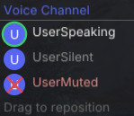

# Discordant

Discord voice channel overlay for Guild Wars 2, built as a [Nexus](https://raidcore.gg/gw2/nexus) addon.

Shows who is in your current Discord voice channel, who is muted/deafened, and who is currently speaking — all rendered in-game via ImGui. Also displays your GW2 character, map, and elite specialization on your Discord profile via Rich Presence.



## AI Notice

This addon has been 100% created largely using Claude. I understand that some folks have a moral, financial or political objection to creating software using an LLM. I just wanted to make a useful tool for the GW2 community, and this was the only way I could do it.

If an LLM creating software upsets you, then perhaps this repo isn't for you. Move on, and enjoy your day.

## How It Works

Discordant connects to the locally running Discord desktop client via its WebSocket RPC server on `127.0.0.1:6463-6472`. It authenticates using Discord's StreamKit OAuth flow (the same mechanism used by the [Discover](https://github.com/trigg/Discover) overlay and OBS StreamKit).

On first use, Discord will show a one-time authorization prompt. After that, the token is cached and reused automatically.

### Voice Overlay

- **User list** — see everyone in your current voice channel
- **Speaking indicator** — green dot when someone is talking
- **Mute/deaf status** — red `[M]` for muted, yellow `[D]` for deafened
- **Auto-follow** — automatically tracks when you switch voice channels
- **Lightweight** — no external processes, no bot, just a single DLL

### Rich Presence

Shows your GW2 status on your Discord profile:

- **Character name** — displayed as the activity title
- **Current map** — shown as the activity subtitle
- **Elite specialization** — shown as the large image (falls back to base profession for core builds)
- All fields are individually toggleable in the Nexus options panel
- Custom Discord Application ID supported if you want to use your own app

### Linux Compatibility

GW2 on Linux runs under Wine/Proton. The addon DLL loads inside Wine, but Discord runs natively on the host. This works because:

- The WebSocket connection uses TCP on `127.0.0.1`, which Wine's Winsock correctly forwards to the host network stack
- No Unix socket or named pipe discovery needed for the voice overlay
- Works with Discord installed natively or as a Flatpak

**Rich Presence on Linux** requires [wine-discord-ipc-bridge](https://github.com/EnderIce2/wine-discord-ipc-bridge) running in the same wineprefix as GW2. It bridges Wine's named pipe namespace to Discord's native socket. Flatpak's sandbox prevents this feature from working.

## Building

### Prerequisites

- CMake 3.20+
- MinGW cross-compiler (`x86_64-w64-mingw32-gcc`, `x86_64-w64-mingw32-g++`)

### Setup

Download dependencies (ImGui and nlohmann/json):

```bash
chmod +x scripts/setup.sh
./scripts/setup.sh
```

### Build

```bash
mkdir build && cd build
cmake -DCMAKE_TOOLCHAIN_FILE=../mingw-toolchain.cmake ..
make
```

This produces `Discordant.dll`.

## Installation

1. Install [Nexus](https://raidcore.gg/gw2/nexus) (place `d3d11.dll` in your GW2 directory)
2. Copy `Discordant.dll` to `<GW2>/addons/`
3. Launch Guild Wars 2
4. Join a Discord voice channel
5. The overlay appears automatically

## Usage

- **CTRL+SHIFT+D** — toggle the status/settings window
- The voice overlay appears automatically when you're in a Discord voice channel
- Quick Access shortcut is added to the Nexus toolbar

## Project Structure

```
discordant/
├── CMakeLists.txt          # Build configuration
├── Discordant.def          # DLL export definition
├── include/
│   ├── nexus/Nexus.h       # Raidcore Nexus API header
│   └── mumble/Mumble.h     # MumbleLink structs
├── src/
│   ├── dllmain.cpp         # Addon entry point, ImGui overlay, Nexus integration
│   ├── DiscordClient.h/cpp # Discord RPC auth flow, voice event handling
│   ├── WebSocket.h/cpp     # Minimal WebSocket client (Winsock2)
│   ├── DiscordIPC.h/cpp    # Named pipe IPC client for Rich Presence
│   ├── RichPresence.h/cpp  # MumbleLink → Discord activity updates
│   └── MapData.h           # GW2 map ID → name lookup table
├── scripts/
│   └── setup.sh            # Dependency download script
└── README.md
```

## License

MIT License

## Third-Party Notices

- [Dear ImGui](https://github.com/ocornut/imgui) — MIT License, Copyright (c) 2014-2021 Omar Cornut
- [nlohmann/json](https://github.com/nlohmann/json) — MIT License, Copyright (c) 2013-2025 Niels Lohmann
- [Nexus API](https://raidcore.gg/Nexus) — MIT License, Copyright (c) Raidcore.GG

## Acknowledgements

- [Discover Overlay](https://github.com/trigg/Discover) — for demonstrating the StreamKit RPC approach
- [Overlayed](https://github.com/overlayeddev/overlayed) — for prior art on Discord voice overlays
- [Hoard & Seek](https://github.com/PieOrCake/hoard_and_seek) — boilerplate for the Nexus addon structure
